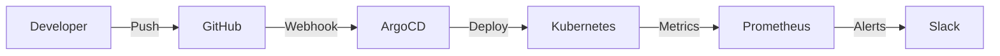

## Overview

This project demonstrates a complete GitOps workflow using ArgoCD to manage Kubernetes deployments. The infrastructure is provisioned with Terraform, and all changes flow through Git.

## Architecture



## Prerequisites

Before getting started, ensure you have:

- Kubernetes cluster (EKS, GKE, or local)
- `kubectl` configured
- ArgoCD CLI installed
- Terraform >= 1.0

## Installation

### Step 1: Bootstrap the Cluster

```bash
# Clone the repository
git clone https://github.com/example/gitops-pipeline
cd gitops-pipeline

# Initialize Terraform
terraform init
terraform apply -auto-approve
```

### Step 2: Install ArgoCD

```bash
kubectl create namespace argocd
kubectl apply -n argocd -f https://raw.githubusercontent.com/argoproj/argo-cd/stable/manifests/install.yaml

# Get the initial admin password
kubectl -n argocd get secret argocd-initial-admin-secret -o jsonpath="{.data.password}" | base64 -d
```

### Step 3: Configure the Application

```yaml
# application.yaml
apiVersion: argoproj.io/v1alpha1
kind: Application
metadata:
  name: my-app
  namespace: argocd
spec:
  project: default
  source:
    repoURL: https://github.com/example/my-app
    targetRevision: HEAD
    path: k8s
  destination:
    server: https://kubernetes.default.svc
    namespace: production
  syncPolicy:
    automated:
      prune: true
      selfHeal: true
```

## Key Learnings

> **Tip:** Always enable self-healing in ArgoCD to automatically revert manual changes to your cluster.

1. **Declarative Configuration** - Everything in Git, no manual kubectl commands
2. **Automatic Sync** - Changes are deployed within minutes of merge
3. **Rollback Capability** - Git history = deployment history
4. **Audit Trail** - Every change is tracked and attributable

## Monitoring

The pipeline integrates with Prometheus and Grafana for observability:

| Metric | Description | Alert Threshold |
|--------|-------------|-----------------|
| `argocd_app_sync_status` | Application sync state | != Synced |
| `argocd_app_health_status` | Application health | != Healthy |
| `kube_deployment_replicas` | Running replicas | < desired |

## Conclusion

GitOps transforms how teams deploy applications. By treating Git as the single source of truth, we gain auditability, rollback capabilities, and a consistent deployment process.

---

*Have questions? Check out the [ArgoCD documentation](https://argo-cd.readthedocs.io/) or open an issue on GitHub.*
